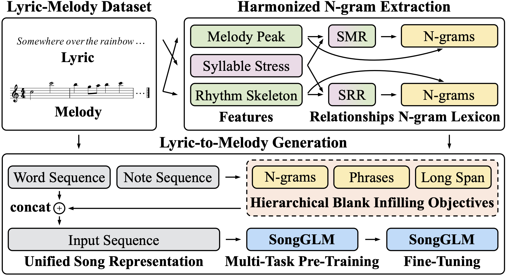

# SongGLM

[SongGLM](https://arxiv.org/abs/2412.18107) is a lyrics-to-melody generation system that leverages 2D alignment encoding and a multi-task pre-training framework to ensure alignment and harmony between lyrics and melody.

<p align="center"><br/> The overall architecture of our SongGLM framework </p>

## Requirements
SongGLM requires following packages:
- os
- re
- glob
- typing
- lightning
- numpy
- torch
- json
- math
- collections
- multiprocessing
- pickle
- miditoolkit
- pandas
- scipy
- operator
- music21
- itertools
- dtw
- functools
- statistics
- sklearn

## Usage

You can now run the following code for harmonized N-gram extraction, span sampling and data preparation, multi-task pre-training, fine-tuning, generation, and evaluation.

### 1. Harmonized N-gram Extraction

Harmonized N-gram extraction is primarily used to capture the correspondence between lyric and melody features, with the current considered features including syllable stress in lyrics and melodic peaks or rhythm skeletons in melodies. 

Harmonized N-gram extraction is only required for the pre-training data (1000 pieces):
```bash
sh script/extract_ngrams.sh
```

### 2. Span Sampling and Data Preparation

Construct a multi-task pre-training framework incorporating three different scales of autoregressive blank-filling objectives:

- Word-Level: Based on an extracted N-gram lexicon, the maximum matching algorithm is used to randomly sample harmonious N-grams, ensuring that the total length of sampled N-grams accounts for 15% of the note sequence.
- Phrase-Level: Multiple musical phrases are sampled from the note sequence such that their total length accounts for 50% of the original sequence length.
- Song-Level: A continuous span is sampled from the note sequence, covering 50% of the original sequence length. 

For pre-training data:
```bash
sh script/prepare_data.sh
```

For fine-tuning data:
```bash
sh script/prepare_data_wiki.sh
```

### 3. Multi-Task Pre-Training

```bash
sh script/pretrain_multitasks.sh
```

### 4. Fine-Tuning

Fine-tune the model in an autoregressive manner on a high-quality lyrics-melody dataset, enabling it to generate melodies from lyrics.

For fine-tuning data (1000 pieces):
```bash
sh script/finetune_multitasks_wiki.sh
```

### 5. Generation

```bash
sh script/generate_multitasks_wiki.sh
```

### 6. Evaluation

```bash
sh script/evaluation_multitasks.sh
```

